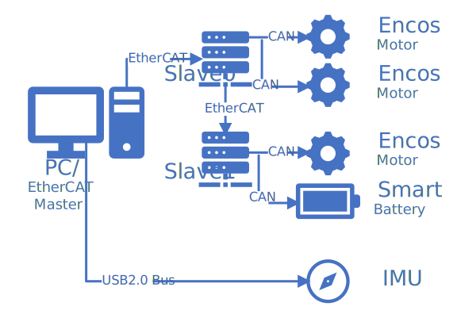

@mainpage

# BitbotEncos

Bitbot Encos是Bitbot机器人控制框架的一个实例。该实例提供Encos电机相关的驱动程序使用户可以快速在安装了Encos电机和EtherCAT转CAN卡的机器人实物上部署自己的控制算法。

> 该Bitbot实例基于Bitbot机器人软件框架设计，关于Bitbot框架的更多详细信息请参阅其[官方网站](https://bitbot.lmy.name/)。

# 硬件配置

BitbotEncos支持的硬件配置包括[Encos电机](http://encos.cn/)，[Yesense IMU](https://www.yesense.com/yis320)，和带有CAN总线的智能电池。BitbotEncos使用Encos推出的EtherCAT转CAN板卡来管理CAN总线设备。关于该板卡的详细信息和电机接线说明请参阅[Bitbot Encos 驱动板说明](./doc/BitbotEncosBusConfig.md)章节。

BitbotEncos的硬件连接关系如下图所示，其中slave0, slave1指的是Bitbot Encos驱动板，PC选用的是配备有以太网功能的计算机，且安装有具备实时内核的linux操作系统。

**注意，在安装电机前请务必配置好电机CAN总线ID**，多个电机接入同一条总线后无法修改ID。



# 软件配置

Bitbot Encos需要在具备实时内核的linux操作系统上运行，已在Ubuntu24.04上测试。Bitbot Encos无需任何依赖，仅需在[发布页面](https://github.com/ZzzzzzS/libBitbotEncos/releases)下载即可开始使用。

注意，soem需要操作rawsocket，因此程序需要root权限或者赋予capability才能运行。可以在生成最终可执行程序的``CMakeList.txt``的``add_executable``函数后添加

```cmake
add_custom_command(TARGET main_app POST_BUILD COMMAND sudo setcap cap_net_admin,cap_net_raw=eip $<TARGET_FILE:main_app> )
```

来自动为可执行文件添加capability，实现无需root权限运行。该命令中的``main_app``为最终可执行项目的名称，请按需替换成用户定义的名称。
**注意，该命令使用了sudo命令，请确保当前用户组属于sudo组，且sudo指令无需输入密码！** 否则编译过程将会卡死。用户也可在构建完成后手动执行``sudo setcap cap_net_admin,cap_net_raw=eip ./main_app``或直接使用root用户运行程序来解决rawsocket的读写问题。

关于soem无root读写rawsocket详情，请参阅[soem-issue83](https://github.com/OpenEtherCATsociety/SOEM/issues/83)。关于linux读写rawsocket的问题请参阅[Using Linux Raw Sockets](https://squidarth.com/networking/systems/rc/2018/05/28/using-raw-sockets.html)。关于如何使sudo命令免密码请参阅[这里](https://cn.linux-terminal.com/?p=2065)。

# 配置说明

和[其它Bitbot实例](https://github.com/limymy/bitbot-mujoco-demo)一样，BitbotEncos需要根据硬件电气连接情况设置配置文件才能正确运行。关于配置文件的详细信息请参阅[Bitbot Encos的配置文件](./doc/BitbotEncosConfig.md)章节，或访问<https://bitbot.lmy.name/docs/bitbot-config_file>获取配置文件的详细信息。

# 电机控制说明

Encos电机支持位置控制，速度控制，力矩/电流控制，和运动模式4种控制模式。关于电机控制的详细说明请参阅[Encos电机模式简介](./doc/BitbotEncosMotorMotion.md)。关于的电机相关API请参阅@ref bitbot::EncosJoint "EncosJoint"。

# 自动零点校准

Bitbot Encos在具有机械限位的关节上具备自动零点校准的功能。可在CMAKE中设置``FUNCTION_AUTO_ZERO``为``ON``来启用该功能。使用该功能还需要在配置文件中设置关节机械限位范围等参数，可参阅[Bitbot Encos的配置文件](./doc/BitbotEncosConfig.md)章节。
**请注意，请勿在没有机械限位的关节上使用该功能以免损坏电机！**

# API

* Bitbot内核接口: <https://bitbot.lmy.name/docs/bitbot-programming>
* 电机控制：@ref bitbot::EncosJoint "EncosJoint"
* IMU控制：@ref bitbot::YesenseIMU "YesenseIMU"

# 免责声明

机器人实物实验是具备一定风险等级的实验。机器人运行时，请勿将身体任何部位伸进机器人的任何空洞内或靠近关节附近。
**开机后请务必确保紧握急停按钮。建议用户在实物实验前进行充分的仿真验证，在实物实验时先不上电空跑来确保安全！** 因不当使用本程序造成的一切后果与作者无关。

# 致谢

小伙伴们，感谢你们关注这个开源项目！开源的魅力在于汇聚众人的智慧与力量，共同打造更优秀的软件。如果你在使用过程中遇到问题，无论是功能上的困惑、操作上的卡顿，还是发现了潜在的漏洞，都请大胆地提issue。你的每一个反馈都是我们进步的阶梯，我们期待与你携手，让这个项目不断完善。
同时，我们也热忱欢迎每一位愿意贡献的伙伴。无论是代码优化、功能拓展，还是文档完善，漏洞修复，你的每一份付出都将为项目添砖加瓦。众人拾柴火焰高，让我们一起努力，让Bitbot在大家的共同努力下，绽放出更耀眼的光芒！Make Bitbot Everywhere!
